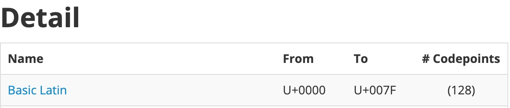

# 每周总结可以写在这里

js 只支持 Unicode。

这个是 Unicode 的官网 https://home.unicode.org/ ，但是不如下面的这个直观：

> 官网中，后来出来了许多 emoji 的字符。但是兼容性比较差，需要格外注意 API 的处理。

https://www.fileformat.info/info/unicode/ 字符集会被分为几种不同的类型

# 1，按 BLOCK 划分

> https://www.fileformat.info/info/unicode/block/index.htm 点击某个 BLOCK后，再点击 List without images (fast)  ，就可以看到该 BLOCK 内的所有字符。

## 1.1，第一个BLOCK



有128个，是最常见的（能用键盘直接打出来的），也就是 ASCII 中的128个字符。

其中常用的有 2 个不可见的字符，
```
U+000A line feed 换行符
U+0020 space 空格
```

1，[String.fromCharCode()](https://developer.mozilla.org/zh-CN/docs/Web/JavaScript/Reference/Global_Objects/String/fromCharCode)，方法返回由指定的UTF-16代码单元序列创建的字符串。参数可传多个。

```
// 打印出128个基本字符（有的是看不见的）
for (let index = 0; index < 128; index++) {
  console.log(String.fromCharCode(index))
}
```

## 1.2，这个 BLOCK 是最常用的中文集合


> 叫 CJK 是因为中日韩是放在一起的。

所以，一般判断是否是中文，就判断是否在 `U+4E00` --> `U+9FFF` 之间。虽然会有遗漏的（还有其他和CKJ相关的BLOCK），但对大部分来说已经足够了。

## 1.3，字符集在 U+10000 之前的，是基本的 BMP 字符。

js 的charcode 系列的API，只能处理之前的这些基本的 BMP 字符，兼容性好。 


之后的字符需要使用下面的 API

```
String.fromCodePoint

''.codePointAt
```

基于以上，所以在 js 中可以用中文作为变量名。

- 为什么最佳实践中，不提倡用中文或是 ASCII 字符集之外的字符，放在源码中？

> 因为会涉及到编码文件。

[codePointAt](https://developer.mozilla.org/zh-CN/docs/Web/JavaScript/Reference/Global_Objects/String/codePointAt)

> codePointAt 的参数：这个字符串中需要转码的元素的位置，该方法返回一个 Unicode 编码点值的非负整数

```
// 需要转成 16 进制的
'厉害'.codePointAt(0).toString(16) // 5389

'厉害'.codePointAt(1).toString(16) // 5bb3
```

下面代码可以正常执行
```
var \u5389\u5bb3 = 1
console.log(厉害)
```

# 2，按 categories 划分

主要是 space（空格）相关，Unicode 中所有的 space 在 JavaScript 中都是合法的。

在 ECMA-262 的附录中（最下面）「A.1 Lexical Grammar」 中，有好几种划分，主要关心的是：

InputElement
- WhiteSpace 空格
- LineTerminator 换行符
- Comment 注释
- Token 一切有效的东西都可以成为 token（上面3个属于无效输入）

## 2.1，WhiteSpace

附录中的 WhiteSpace 有6种，<USP> 就是 Unicode 中的（<USP> 只包含 <SP>）。

```
WhiteSpace
 <TAB>
 <VT>
 <FF>
 <SP>
 <NBSP>
 <ZWNBSP>
 <USP>
```

前4个可以在 [category的最后一个分类](https://www.fileformat.info/info/unicode/category/index.htm) 中找到。

最后一个比较特殊，可以在 ECMA 中查找。

1，<TAB>

也属于 whitespace 的一种，`\t` 就是一个 tab，它的 size 一般通过编辑器可以设置。

为什么叫制表符，是因为可以形成类似表格的排版，

下面的输入每次都以tab分割，可以看到归整的分开。
```
1   89
23  98
901 1
```
tab 在 Unicode 的编码中是 `U+0009`
```
'\t'.codePointAt(0) // 9
```

2，<VT>

纵向制表符 `\v` `U+0011` ，没什么卵用。

3，<FF>

换页符 FORM FEED `\f` `U+000C`

4，<SP>

普通空格 `U+0020`

5，<NBSP>

`&nbsp;` 表示 NO-BREAK SPACE `U+00A0`

侧重于排版上的一个词。

在 html 中，对一句英文来说，如果它的容器宽度不够了，就会换行，换行是以单词来进行分割的，也就是说，在换行时不会将一个词分开。


如果想将 javaScript 变成 java script，同时不想让他们在换行时分开，可以 `java&nbsp;script`


所以，其实可以在浏览器控制台输入 `\u00A0` 后，将打印出的空格复制粘贴到代码中，就可以替换 `&nbsp;`

6，<ZWNBSP>

`U+FEFF` zero width NO-BREAK SPACE

属于历史遗留问题，

微软的工程师为了推断文件的类型，在每个文件的最开发加一个0宽的空格的，以它的字节顺序，反猜文件的编码格式。

又起了一个名字 BOM （bit order mask）。

淘宝的最佳实践中，js 文件第一行要空出来，就是因为这个问题导致传递给服务端时可能解析有 bug。（如果按照 BOM解析，就会吞一个字符。）


## 2.2，LineTerminator 换行符

附录简单介绍了
```
LineTerminator
 <LF>
 <CR>
 <LS>
 <PS>
```

具体在 ECMA 的 11.3 节

> 此处缺一个表格

<LF> `U+000A` line feed  换行 `\n`

<CR> `U+000D` carriage return  回车 `\r`

<LS> 分行符 `U+2028`

<PS> 分段符 `U+2029`

一般后面2个不要用，因为超出了 Unicode 编码之外。

正常情况下，就是用 `\n` 即可。

一般来说，JavaScript 的项目中，最佳实践是将字符都限制在 ASCII 编码内，至多限制在 Unicode BMP 编码内。


## 2.3，注释 Comment

多行注释 `/**/` 中的 * 不能使用对应的 `\u002a` 替代，必须是一个 *


## 2.4，Token

- Punctuator 符号
- Keywords
- Literal 直接量
- Identifier 标识符
    - 变量名
    - 属性名（可和关键字重合，js的特殊之处）


> Punctuator + Keywords 形成程序的结构。   
Literal + Identifier，是我们写出来的程序信息。


因为这个特殊之处，所以也可以这样划分

```
- Punctuator 符号
- Literal 直接量
- IdentifierName 必须以字母开头
    - Keywords
    - Identifier
    - Future reserved Keywords 将来可用的关键字（目前就剩下 enum）
```
在没有引入词法之前，`document.body.class` 是会报错的，因为 `class` 属于关键字。这也导致了想要获取 class 时要使用 `document.body.className` 。


### 2.4.1，Identifier

变量名等。

IdentifierStart 可以使用的 `ID_Start` 包括 UnicodeIDStart 的 `$ _`

### 2.4.2，Punctuator

`+ - * / = ` 等符号

### 2.4.3，Literal

直接写的数字，字符串，布尔值等直接量。

> undefined 是一个无法更改的全局变量名，不是关键字。

==离开全局作用域就可以更改==！

[void在立即执行函数的使用](https://developer.mozilla.org/zh-CN/docs/Web/JavaScript/Reference/Operators/void)

> 在使用立即执行的函数表达式时，可以利用 void 运算符让 JavaScript 引擎把一个function关键字识别成函数表达式而不是函数声明（语句）。

```
void function() {
  var undefined = 3
  console.log(undefined) // 3
}()
```

但是直接声明 `var null` 会报错。

#### 2.4.3.1，Number

`0o11` 是8进制

`0b001` 是2进制，

`0x111` 是16进制

十进制时，`.` 前后都可以省略。

虽然可以通过 `parseInt` 的第二个参数，来转换进制，但还是推荐直接使用上面进制的写法，来写对应进制的数值。

因为小数都是浮点数，所以运算时永远不可能绝对相等，要比较的话


1，Safe Integer，安全的整数范围

```
Number.MAX_SAFE_INTEGER.toString(16) // "1fffffffffffff"
```

2，Float Compare

浮点数的比较，一般是不可能真正的相等，要比较可以用以下的方式：
```
// 小于等于精度
Math.abs(0.1+0.2-0.3) <= Number.EPSILON
```

#### 2.4.3.2，String

1，字符集：

- ASCII
- Unicode
- UCS (U+0000 -- U+FFFF)
- GB （只包含 ASCII + 中文）
- ISO-8859 欧洲的字符
- BIG5 （只包含 ASCII + 繁体中文）

因为GB 和 ISO-8859 除了 ASCII 编码之外，码点不一致，所以显示的字符也不一致。

2，编码方式

UTF-8 等。

以中文和ASCII 为主的话，UTF-8最合适。

如果是欧洲字符和ASCII为主，UTF-16最合适。 


3，语法

`\'` 和 `\"` 不会破坏字符串的闭合关系，都表示一个引号。

字符串中的 `\` 后面除了跟 `\ b f n r t v` 分别表示不同的字符。

> 对应 ECMA-262 中的 Table 34

还有，

`\u` 用来表示 unicode 字符

`\x` 用来表示16进制。

跟其他的字符，并且没有什么意义。

- 为什么会有 `\n`（换行符） 和 `\r`（换页符） 呢，

> 因为对于老式打印机来说，因为上面的横梁不能动，所以有进纸和回车两种操作。

字符串模板：

js 引擎在解析时，是按照
- 第1个反引号到`${`
- js 代码
- `}` 到第2个反引号
```
`i say: "${
  s
}"`
```

正则字面量

```
// 可以解析为正则
var a
if (a)/a/g
```
```
// 解析为除法
var a;
a
/a/g
```
