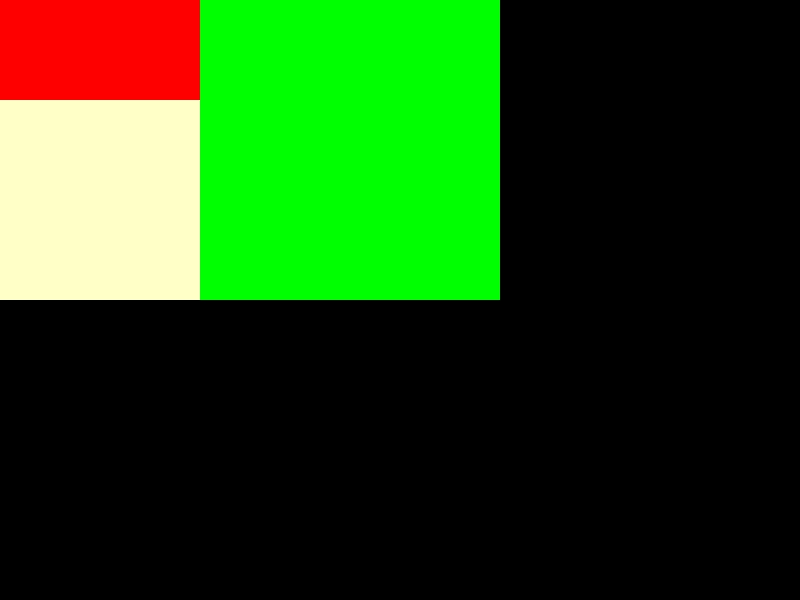
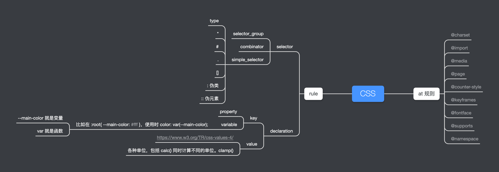

# 每周总结可以写在这里

## 1，css 排版

收获
- 对 flex 的属性都复习了一遍。
- 对使用 vscode 做代码调试又得心应手了一些。

> 因为照着老师的代码写，也有一些内容写漏了，有的是通过代码调试才找到了问题所在。

- 了解了 [images](https://www.npmjs.com/package/images) 这个库的作用。
- 掌握了使用 nvm 管理不同的 node 版本。

> 因为 images 库只能在 v10.x 的版本运行，其他低版本未做测试。

最后的绘制结果



## 2，css 基本语法和规则




获取 [W3C标准](https://www.w3.org/TR/?tag=css)
``` js
const list = document.getElementById('container').children
const ret = []

for (const li of list) {
  if (li.getAttribute('data-tag').match(/css/)) {
    ret.push({
      name: li.children[1].innerText,
      url: li.children[1].children[0].href
    })
  }
}
console.log(ret)
```