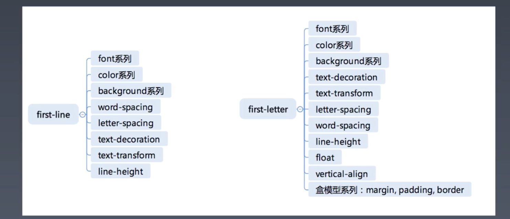

# 每周总结可以写在这里

# 1，选择器分类

## 1.1，简单选择器

- `*`
- div svg|a
- .cls
- #id
- [attr=value]
- :hover
- ::before

| 的形式，是namespace，因为选择 svg 中的 a 标签和html 中的不一样。（特定命名空间下的）

## 1.2，复合选择器

<简单选择器><简单选择器><简单选择器>

- `*` 或 div 必须写在最前面
- 伪类和伪元素必须写在最后面。

## 1.3，复杂选择器

- <简单选择器>空格<简单选择器>
- <简单选择器>`>`<简单选择器>
- <简单选择器>`~`<简单选择器>
- <简单选择器>`+`<简单选择器>
- <简单选择器>`||`<简单选择器>


# 2，选择器优先级

https://specifishity.com/ 这个网址很有用。

练习
```
div#a.b .c[id=x]
#a:not(#b)
*.a
div.a
```
答案↓
```
0 1 3 1
0 2 0 0
0 0 1 0
0 0 1 1
```

注意点：

- 属性选择器 和 类选择器优先级一致。
- :not() 不改变优先级
- `*` 不改变优先级
- 空格 ~ + 等都不改变优先级
- 选择器书写顺序，不改变优先级


如何验证 属性选择器和类选择器优先级相同?
> 互换位置，看是否会相互覆盖。


# 3，伪类

## 3.1，超链接/行为相关

- :any-link
- :link :visited
- :hover
- :focus
- :target

> :target 是锚点跳转时，锚点选中时。


焦点系统，在特定场景下是很有用的，比如鼠标坏了（物理或驱动），就需要键盘操作。

> 操作系统的焦点系统就很完备。

## 3.2，树结构

- :empty
- :nth-child()
- :nth-last-child()
- :first-child :last-child: :only-child

> :nth-last-child，:last-child 和 :only-child 在 start tag 阶段(toy-browser项目有实现)是无法实现的。

所以，大部分浏览器会实现 :empty, :nth-child, :first-child

在 start tag 阶段是无法实现的3个不推荐使用，因为即便实现了也比较复杂，会影响layout的次数。

> 但一些情况确实是要选中最后一个。

## 3.3，逻辑型

- :not()
- :where :has

唯一能用的是 not，放复合选择器的就行，不要太复杂。

# 4，伪元素

- ::before
- ::after
- ::firstLine
- ::firstLetter

> ::firstLetter 是指排版的第一行。

它们支持的属性：



## 4.1，问题

- 1，为什么 first-line 没有 float 属性？

float 脱离流出去，和 first-line 的定义矛盾了吧

会脱离文档流，会自动选中剩下的第一行，出现无限循环吧。

- 2，first-line 为什么可以改字体？

在排版时，将first-line 相关的属性直接加到文字上。到了第二行，就将 first-line 相关的伪类属性都撤销掉。所以它的属性都是和文字相关。

> first-letter 就是第一个字母，很固定，所以可以加盒模型什么的都无所谓。既然是固定的第一个，所以也不会出现问题1中的循环。

# 5，正常流

从左到右，就是 IFC inline formatting context

从上到下，就是 BFC block formatting context

正常流的行模型 IFC

- 行内的盒和文字有对齐关系，文字以基线对齐。
- 行高

一个 line-box，
- 里面没有任何文字，基线在盒的最底部。
- 有文字，基线就在文字的最底部。

所以，一般一个inline-block，要设置它的`vertical-align: top 或 bottom`，才可以。

> 设置 top 或 bottom，会影响文字不同的排版位置。因为该盒会将父级撑开。

所以，一行的行高，
- 如果有子元素的高度超过了父级的行高，那就是子元素高度，
- 否则就是父元素的行高

推荐只使用 vertical-align 的 `top bottom middle` 这3个属性，其他的会有奇奇怪怪的表现。

1.  Vertical-align: baseline，是拿自己的 baseline 去对齐行的 baseline 

2.  Vertical-align: top，middle，bottom，是拿自己的 ”顶部“ “中线” ”底部“ 去对齐行的 ”顶部“ “中线” ”底部“ 

3.  vertical-align: text-top，text-bottom，是拿自己的 ”顶部“ ”底部“ 去对齐行的 text-top 和 text-bottom 线吗


浏览器会根据页面的条件和实际的inline盒子的宽度来计算产生几个盒。像是这样超出宽度就会产生多个盒，代码上只是一个span中有很多文字。

# 6，margin 折叠

只能发生在 BFC 中，正常流里的容器都能产生 BFC

inline-block:可以当两部分看，
- 对外面的它的兄弟节点来说，他是一个inline元素，
- 对它包含的元素来说，他是一个可以包含block的container，建立BFC

block-container 是里面有正常流的东西，只有 block 和 inline-block 里面有正常流。

flex 不是，它的 item 才是。

不带 inline 的都是 block-level-box
