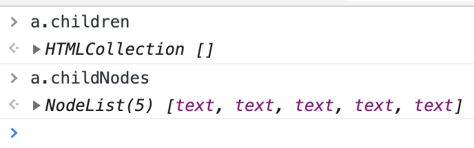

# 每周总结可以写在这里

# 1，动画

webgl

没有什么东西。

# 2，HTML

常用实体

```
<!ENTITY quot    CDATA "&#34;"   -- quotation mark = APL quote,
                                    U+0022 ISOnum -->
<!ENTITY amp     CDATA "&#38;"   -- ampersand, U+0026 ISOnum -->
<!ENTITY lt      CDATA "&#60;"   -- less-than sign, U+003C ISOnum -->
<!ENTITY gt      CDATA "&#62;"   -- greater-than sign, U+003E ISOnum -->
```

- amp 就是 & 
- quot 就是双引号
> 所以在 HTML 中推荐使用双引号，因为可使用 quot 转义。


## 2.2，语义

1，`<aside>` 是指非主体的部分，并不是只代表侧边栏。

2，下面中间不能加 hr（一条线），因为 hr  表示故事走向的转变或者话题的转变。

而 h1 和 h2 是补充的关系。
```
<hgroup>
    <h1>World Wide Web</h1>
    <hr>
    <h2>From Wikipedia, the free encyclopedia</h2>
</hgroup>
```

3，补充说明，直接用 div 即可。

`<abbr>WWW</abbr>` 表示缩写。

对语义把握不准的，就用 div 和 span 即可。

4，目录，就是导航，所以可以用 `nav` 套着。
- 目录的标题可以用 `h3` 套着（如果有 h2 的话）。
- 其他的用 `a` 套着。所有的 `a` 在用 `ol li` 套着。

ol 的表现是 1，2，3，4，如果想变成小圆点，也不能用 ul，因为语义这里就是有序列表，可以使用 css 来控制。

```
<div>
    <nav>
      <h3>Contents</h3>
      <ol>
        <li><a href="#">History</a></li>
        <li>
          <a href="#">Function</a>
          <ol>
            <li><a href="#">Linking</a></li>
            <li><a href="#">Dynamic updates of web pages</a></li>
            <li><a href="#">WWW prefix</a></li>
            <li><a href="#">Scheme specifiers</a></li>
          </ol>
        </li>
        <li><a href="#">Web security</a></li>
      </ol>
    </nav>
</div>
```

5，示例，用 `samp` 标签（代表程序或电脑的输出）。排版好的文字用 `pre` 标签，注意里面的内容要顶格写。

```
        <samp>
          <pre>
GET /home.html HTTP/1.1
Host: www.example.org
          </pre>
```

6，dfn，表示定义

下面这段，dfn 包裹的就是被定义的词。

> terms 表示属术语，后面就会解释提到的术语，所以这个词就是一个提示。

```
<p>The terms Internet and World Wide Web are often used without much distinction. However, the two are not the same. 
<dfn>The Internet</dfn> is a global system of interconnected computer networks. In contrast, <dfn>the World Wide Web</dfn> is a global collection
of documents and other resources, linked by hyperlinks and URIs. Web resources are accessed using HTTP or HTTPS, which
are application-level Internet protocols that use the Internet's transport protocols</p>
```

`dt` 和 `dd` 就是`dfn` 的列表形态。
```
<dl>
  <dt></dt><!--defination term-->
  <dd></dd><!--defination description-->
</dl>
```


7，`cite` 是被引用的文章名，`blockquote` 是被引用的文章内容

8，时间可以用 `time` 标签。

- 1980s
- 

9，address 表示的 `address` 的父级的这篇文章的作者的联系地址。

10，section 中可以套 h1

11，p标签可以不闭合。


## 2.3，语法

1，合法元素
- element
- text
- comment
- cdata

2，字符引用
- &#161，表示小写 i
- &amp，表示 &
- &lt
- &quot

3，DOM

DOM 树中的基本单位是 node，所以DOM树中存的东西，一定是 Node 
- Element，元素节点
- Document 文档根节点
- Character
    - Text 文本节点
    - comment 注释
    - processingInstruction 处理信息
- DocumentFragment，文档片段
- DocumentType，文档类型

### 2.3.1，操作

Nodes 和 element 其实没多少区别
```
const a = docuemnt.getElementById('a')

a.children // HTMLCollection []
a.childNodes // NodeList(4) [div, div, div, div]
```

1，导航类操作

Node相关（有对应的element）

- parentNode
- childNodes (children)
> living collection，所有的修改操作，会实时改变这个属性，在 js 中获取的数组也会实时变化

- firstChild
- lastChild
- nextSibling
- previousSibling

2，修改操作
- appendChild
- insertBefore
- removeChild
- replaceChild

**所以的 DOM 元素，默认只有一个父元素，所以不能被2次插入到DOM树中！**

> 当向第二个位置插入时，会在第一个位置处 remove 掉。

所以，只要将其挂到另一个位置，之前位置处自动就被摘下来。


==living collection==

```
<div id="a">
  <div>1</div>
  <div>2</div>
  <div>3</div>
  <div>4</div>
</div>

<div id="b"></div>

<script>
  const a = document.getElementById('a')
  const b = document.getElementById('b')
  for (let i = 0; i < a.children.length; i++) {
    b.appendChild(a.children[i])
  }
</script>
```
因为实时改变的，所以最终 element是：
```
<div id="a">
  <div>2</div>
  <div>4</div>
</div>

<div id="b">
  <div>1</div>
  <div>3</div>    
</div>
```
所以，如果要将 a 中的 children 依次放入 b 中，可以这样
```
while (a.children.length) {
  b.appendChild(a.children[0])
}
```

事情并没有完。可以看到上面代码中使用的都是 `a.children`，并没有使用 `a.childNodes`。当上面的代码执行完成后，再看 `a.children` 和 `a.childNodes` 都是什么:



<details>
  <summary>为什么都是 text?</summary>
  
  因为这个例子中的 html 的书写，用的就是留有空格的形式，这些空格都是 text 节点。所以都保留着。并且可以看到有5个。
  
  所以，如果用 `childNodes.length` 遍历的话，最后会有一个 undefined 报错。
  
  所以，在操作 element 时，最好使用 element相关的 API。
</details>

<br>

3，高级操作

- document.compareDocumentPosition，比较2个节点中的关系（document 的先后等）
- document.contains，检查一个节点是否包含另一个节点
- document.isEqualNode，检查2个节点是否完全相同
- document.isSameNode，检查2个节点是否是同一个节点，事实上，在 js 中可以用 `===` 来比较。
- document.cloneNode，复制一个节点，如果传入参数 true，则会连同子元素做深拷贝。

