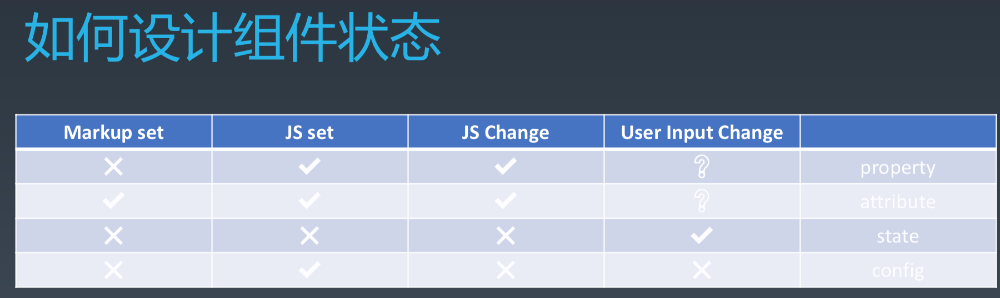
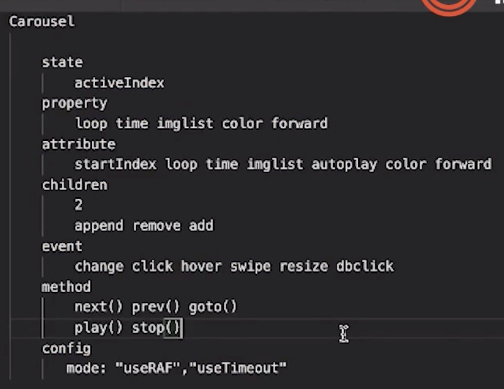

# 每周总结可以写在这里

# 1，Proxy和双向绑定

都在代码里了。

# 2，Range API 

实现拖动 div 到任意位置，可以和文字混排。

# 3，组件化基础

## 3.1，attribute vs property

1，attribute 可以既通过标记语言直接设置，也可以通过 js 设置。

```
<my-component attribute="v" />
myComponent.getAttribute('a')
myComponent.setAttribute('a', value)
```
property 只能通过 js 设置。
```
myComponent.a = value
```

2，在 js 中，比如获取 class 或 style，二者语义是相同的。

3，input 的 value
```
<input type="text" value="cute">
```
- 如果直接更改的是 attribute，input 输入框的内容也实时变化。
    - 直接在浏览器的 Element 下修改元素（以标记语言的方式更改）。
    - `document.getElementsByTagName('input')[0].setAttribute('value', 2)`
- 如果直接更改的是 property，则 input 输入框的内容之后将始终和 property 保持一致。也就是说，更改 attribute 将只会更改 attribute，不影响其他了。
    - 在输入框直接修改
    - `document.getElementsByTagName('input')[0].value = 2`


基本组件的结构

```
class MyComponent {
  constructor(config) {
    this.state = {
      a: 1
    }
  }
  set(prop, value) {

  }

  get() {

  }

  setAttribute(attr, value) {

  }

  getAttribute(attr) {
  }
}

<MyComponent attr1="22"></MyComponent>
```

## 3.2，组件状态的设计



## 3.3，children

1，Content
```
<my-button>{{ title }}</my-button>
```

2，Template
```
<my-list>
    <li>{{ title }}</li>
</my-list>
```
就像 element 的 table 组件一样。
```
<template v-slot="{row}">
    <el-button type="text" @click.stop="goToEdit(row)">查看</el-button>
</template>
```

## 3.4，轮播组件的设置

组件的设计是多样的：

1，如果 state 中没有 activeIndex，而是放到 property 中，则 method 中的 prev(), next(), goto() 都不需要了。

2，如果 property 中有 autoplay，那 method 中的 play(), stop() 也不需要了。

而 autoplay 放到 attribute 中，那 method 中需要 play(), stop()

