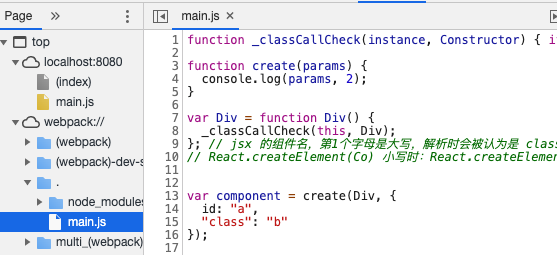

# 每周总结可以写在这里

具体细节都在代码中提现。

1，webpack 配置中`pragma: 'creaaaaaa'`，可以更改编译 jsx 后的语法。[pragma参数](https://babeljs.io/docs/en/babel-plugin-transform-react-jsx)，默认是 `React.createElement`

```
module.exports = {
  entry: './main.js',
  module: {
    rules: [
      {
        test: /\.m?js$/,
        exclude: /node_modules/,
        use: {
          loader: 'babel-loader',
          options: {
            presets: ['@babel/preset-env'],
            plugins: [["@babel/plugin-transform-react-jsx",{ pragma: 'creaaaaaa'}]]
          }
        }
      }
    ]
  },
  mode: 'development',
  optimization: {
    minimize: false
  }
};
```

2，在开启了下面的配置项后，
```
mode: 'development',
  optimization: {
    minimize: false
  }
```

启用 webpack-dev-server 后，在这里可以看到运行的源码。

