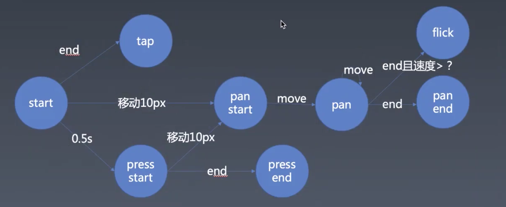

# 每周总结可以写在这里

1，移动端轮播组件已有的问题
- 轻触后如果只滑动一点点，会被当成点击。
- 如果没有滑到 1/2，但速度很快，也会播放下一个。
- 如果一开始纵向滑动，在横向便无法滑动了。


2，手势的分类

- tap
- pan panstart, panmove, panend
- flick
- press pressstart pressend



手势的架构，监听，识别，分发

3，禁用

[鼠标右键](https://developer.mozilla.org/zh-CN/docs/Web/API/Element/contextmenu_event)

```
window.addEventListener('contextmenu', e => {
  e.preventDefault();
});
```

4，自定义事件

https://developer.mozilla.org/en-US/docs/Web/Guide/Events/Creating_and_triggering_events